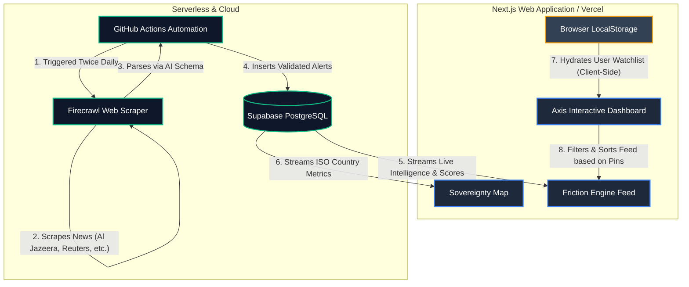

<div align="center">

# 🌍 AXIS AFRICA

### African X-ray Intelligence System

**Real-time strategic intelligence platform tracking sovereignty, resource wealth, and outside influence across all 54 African nations.**

[](https://axis-mocha.vercel.app)
[](https://nextjs.org)
[](LICENSE)

</div>

---

## What is AXIS?

**A**frican **X**-ray **I**ntelligence **S**ystem — a strategic intelligence dashboard that provides a comprehensive, data-driven view of Africa's sovereignty landscape.

AXIS tracks:
- 🏛️ **Sovereignty scores** for all 54 nations (0-100 composite metric)
- ⛏️ **Resource wealth** metrics with key natural resources per country
- 📡 **Live OSINT** intelligence scraped from Al Jazeera, Mining Weekly, African Business & Medium
- 🗺️ **Interactive heat map** with country-level filtering
- 📊 **Country dossiers** with strategy, exports, and friction analysis
- 🌐 **Outside influence tracking** — monitoring foreign power impact on African affairs

## Features

### Interactive Sovereignty Heat Map
Countries are color-coded by their Axis Score — green for high sovereignty, red for extractive economies. Click any country to filter the entire dashboard.

### Live Intelligence Engine
Powered by [Firecrawl](https://firecrawl.dev), the platform scrapes multiple news sources in real-time, classifying articles as **Sovereignty Risk** or **Outside Influence**.

### Resource Wealth Tracking
Every nation has a resource wealth score based on verified mineral and energy endowment data, with key resources tagged (Cobalt, Gold, Oil, Platinum, etc.).

### Country Dossiers
Click any country for a detailed modal with three tabs:
- **Strategy** — Score breakdown and key initiatives
- **Exports** — Commodity pipeline with destinations and values
- **Friction** — Active threat vectors and severity levels

## Tech Stack

| Layer | Technology |
|---|---|
| Framework | Next.js 16 (App Router) |
| Database | Supabase (PostgreSQL + RLS) |
| Automation | GitHub Actions (Cron Jobs) |
| OSINT Engine | Firecrawl API via Node.js |
| Mapping | React Simple Maps + D3 |
| State | Browser LocalStorage |
| Hosting | Vercel |

## Architecture & Data Flow



## Getting Started

```bash
# Clone the repository
git clone https://github.com/Oddjobe/Axis.git
cd Axis

# Install dependencies
npm install --legacy-peer-deps

# Set up environment variables
cp .env.example .env.local
# Add your FIRECRAWL_API_KEY

# Run development server
npm run dev
```

Open [http://localhost:3000](http://localhost:3000) to view the dashboard.

## Environment Variables

For the application to run successfully locally or on Vercel, you need the following environment variables in `.env.local`:

| Variable | Description |
|---|---|
| `NEXT_PUBLIC_SUPABASE_URL` | Your Supabase project URL |
| `NEXT_PUBLIC_SUPABASE_ANON_KEY` | Your public Supabase API key |
| `FIRECRAWL_API_KEY` | API key from [firecrawl.dev](https://firecrawl.dev) (Used by the GitHub action) |
| `SUPABASE_SERVICE_ROLE_KEY` | Master database bypass key (Only required in GitHub Actions Secrets) |

## Sovereignty Index Explained

| Status | Score | Meaning |
|---|---|---|
| 🟢 OPTIMAL | 75+ | Strong sovereignty trajectory |
| 🔵 STABLE | 60-74 | Consistent metrics, no major risks |
| 🟡 IMPROVING | 51-59 | Positive reform trend underway |
| 🔴 EXTRACTIVE | ≤50 | Resources leaving without value capture |

## Contributing

Contributions are welcome! This platform is built for the African community. If you'd like to:
- Add new data sources
- Improve the map or visualizations
- Add support for African languages
- Fix bugs or improve performance

Please open a pull request.

## License

MIT License — see [LICENSE](LICENSE) for details.

## Acknowledgments

- [Supabase](https://supabase.com) — Open source Firebase alternative
- [Firecrawl](https://firecrawl.dev) — OSINT scraping engine
- [react-simple-maps](https://www.react-simple-maps.io/) — SVG map rendering
- [Vercel](https://vercel.com) — Hosting and deployment
- The African developer community 🤝🏿

---

<div align="center">

**Built with purpose. Built for Africa.**

[Live Demo](https://axis-mocha.vercel.app) · [Report Bug](https://github.com/Oddjobe/Axis/issues) · [Request Feature](https://github.com/Oddjobe/Axis/issues)

</div>
