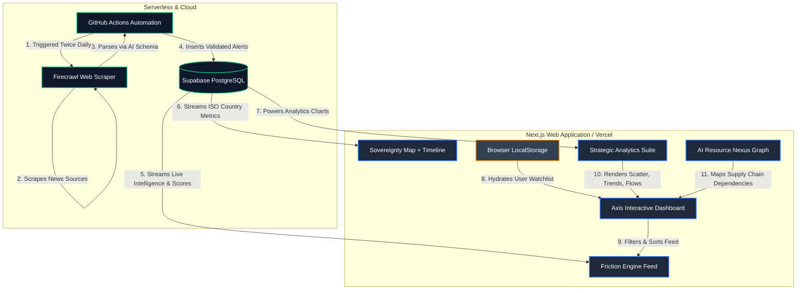

<div align="center">

# 🌍 AXIS AFRICA

### African X-ray Intelligence System

**Real-time strategic intelligence platform tracking sovereignty, resource wealth, and outside influence across all 54 African nations.**

[](https://axis-mocha.vercel.app)
[](https://nextjs.org)
[](LICENSE)

</div>

---

## What is AXIS?

**A**frican **X**-ray **I**ntelligence **S**ystem — a strategic intelligence dashboard that provides a comprehensive, data-driven view of Africa's sovereignty landscape. AXIS treats Africa as **Layer Zero** of the global technology supply chain and provides the tools to understand, visualize, and act on that reality.

AXIS tracks:
- 🏛️ **Sovereignty scores** for all 54 nations (0–100 composite metric)
- ⛏️ **Resource wealth** metrics with key natural resources per country
- 📡 **Live OSINT** intelligence scraped from Al Jazeera, Mining Weekly, African Business & Medium
- 🗺️ **Interactive heat map** with country-level filtering and historical timeline
- 📊 **Country dossiers** with strategy, exports, and friction analysis
- 🌐 **Outside influence tracking** — monitoring foreign power impact on African affairs
- 🧠 **AI Resource Nexus** — force-directed knowledge graph mapping Africa's role in the AI supply chain
- 📈 **Strategic analytics** — scatter plots, trendlines, influence flows, and more

## Features

### 🗺️ Interactive Sovereignty Heat Map
Countries are color-coded by their Axis Score — green for high sovereignty, red for extractive economies. Click any country to filter the entire dashboard. Includes a **historical timeline slider** that animates score changes across years.

### 📡 Live Intelligence Engine (Friction Engine)
Powered by [Firecrawl](https://firecrawl.dev), the platform scrapes multiple news sources in real-time, classifying articles as **SOVEREIGNTY RISK** or **OUTSIDE INFLUENCE** with severity ratings. Data is persisted to Supabase via automated GitHub Actions cron jobs.

### ⛏️ Resource Wealth Tracking
Every nation has a resource wealth score based on verified mineral and energy endowment data, with key resources tagged (Cobalt, Gold, Oil, Platinum, Lithium, etc.).

### 📋 Country Dossiers
Click any country for a detailed intelligence modal with three tabs:
- **Strategy** — Score breakdown, key initiatives, and sovereignty trajectory
- **Exports** — Commodity pipeline with destinations and values
- **Friction** — Active threat vectors, severity levels, and source citations

### 📊 Strategic Analytics Modal
A comprehensive analytics suite with four specialized dashboards:

| Tab | Name | Description |
|-----|------|-------------|
| 📊 | **The Extractivist Trap** | Scatter plot of Resource Wealth vs. Sovereignty Score — exposing nations with high potential but low value capture |
| 📈 | **Sovereignty Trends** | 10-year trajectory area charts per country, visualizing whether nations are gaining or losing economic independence |
| 🌐 | **Influence Flows** | Nivo Sankey diagram mapping negative influence vectors from China, US, Russia, France, IMF/World Bank into vulnerable African states |
| 🧠 | **AI Nexus** | Interactive force-directed knowledge graph (see below) |

### 🧠 AI Resource Nexus Graph
An interactive, physics-powered knowledge graph visualizing Africa's critical role in the AI supply chain:

```
African Nations → Critical Minerals → Refined Components → AI End Products
(DRC, Zambia...)   (Cobalt, Lithium...)  (Batteries, Chips...)  (GPUs, LLMs, Data Centers)
```

**Features:**
- Force-directed layout with `react-force-graph-2d` and tuned `d3-force` physics
- Dynamic particle animations along supply chain links
- Hover-to-isolate: highlighting connected edges and fading unrelated nodes
- Floating detail cards with node descriptions and flow metrics
- Full-screen expansion support
- Custom canvas-rendered nodes with glow effects and outlined text labels

### 🔄 Continental Goals Ticker
Scrolling marquee of pan-African continental development goals (Agenda 2063, AfCFTA milestones), providing persistent context.

### 👁️ Watchlist System
Pin countries to your personal watchlist (persisted in LocalStorage) — pinned countries are prioritized in the intelligence feed and highlighted on the map.

### 🌓 Dark & Light Mode
Fully themed UI with smooth transitions, premium aesthetics in both modes, and proper contrast for all map and chart elements.

## Tech Stack

| Layer | Technology |
|---|---|
| Framework | Next.js 16 (App Router, Turbopack) |
| Language | TypeScript 5 |
| Database | Supabase (PostgreSQL + RLS) |
| Automation | GitHub Actions (Cron Jobs) |
| OSINT Engine | Firecrawl API |
| Mapping | React Simple Maps + D3-Geo |
| Charts | Recharts + Nivo Sankey |
| Graph Viz | react-force-graph-2d + d3-force |
| Animation | Framer Motion |
| Styling | Tailwind CSS 4 |
| State | Browser LocalStorage |
| Hosting | Vercel |

## Architecture & Data Flow



## Getting Started

```bash
# Clone the repository
git clone https://github.com/Oddjobe/Axis.git
cd Axis

# Install dependencies
npm install --legacy-peer-deps

# Set up environment variables
cp .env.example .env.local
# Add your FIRECRAWL_API_KEY and Supabase keys

# Run development server
npm run dev
```

Open [http://localhost:3000](http://localhost:3000) to view the dashboard.

## Environment Variables

| Variable | Description |
|---|---|
| `NEXT_PUBLIC_SUPABASE_URL` | Your Supabase project URL |
| `NEXT_PUBLIC_SUPABASE_ANON_KEY` | Your public Supabase API key |
| `FIRECRAWL_API_KEY` | API key from [firecrawl.dev](https://firecrawl.dev) |
| `SUPABASE_SERVICE_ROLE_KEY` | Master database bypass key (GitHub Actions only) |

## Sovereignty Index Explained

| Status | Score | Meaning |
|---|---|---|
| 🟢 OPTIMAL | 75+ | Strong sovereignty trajectory |
| 🔵 STABLE | 60–74 | Consistent metrics, no major risks |
| 🟡 IMPROVING | 51–59 | Positive reform trend underway |
| 🔴 EXTRACTIVE | ≤50 | Resources leaving without value capture |

## Project Structure

```
src/
├── app/
│   ├── page.tsx                    # Main dashboard
│   ├── layout.tsx                  # Root layout + SEO
│   ├── api/
│   │   ├── intelligence/route.ts   # OSINT scraping endpoint
│   │   └── blogs/route.ts          # Blog aggregation endpoint
│   ├── robots.ts                   # SEO robots.txt
│   └── sitemap.ts                  # SEO sitemap
├── components/
│   ├── africa-map.tsx              # Interactive SVG heat map
│   ├── friction-engine.tsx         # Live intelligence feed
│   ├── analytics-modal.tsx         # Strategic analytics (4 tabs)
│   ├── ai-resource-graph.tsx       # AI Nexus force graph
│   ├── wealth-vs-sovereignty-chart.tsx  # Extractivist Trap scatter
│   ├── sovereignty-trendline-chart.tsx  # 10-year trajectory
│   ├── influence-sankey-chart.tsx   # Influence flows Sankey
│   ├── country-dossier-modal.tsx   # Country detail modal
│   ├── continental-goals-ticker.tsx # AU goals marquee
│   ├── afcfta-matrix.tsx           # AfCFTA trade matrix
│   └── mission-modal.tsx           # Platform mission overlay
├── lib/
│   ├── supabase.ts                 # Database client
│   ├── use-watchlist.ts            # Watchlist hook
│   └── i18n.ts                     # Internationalization
└── scripts/
    ├── seed.ts                     # Database seeder
    └── scrape.ts                   # Cron scraping script
```

## Contributing

Contributions are welcome! This platform is built for the African community. If you'd like to:
- Add new data sources or intelligence feeds
- Improve visualizations or add new analytics
- Add support for African languages
- Expand the AI Nexus graph with more supply chain data
- Fix bugs or improve performance

Please open a pull request.

## License

MIT License — see [LICENSE](LICENSE) for details.

## Acknowledgments

- [Supabase](https://supabase.com) — Open source Firebase alternative
- [Firecrawl](https://firecrawl.dev) — OSINT scraping engine
- [react-simple-maps](https://www.react-simple-maps.io/) — SVG map rendering
- [Recharts](https://recharts.org) — Composable chart components
- [Nivo](https://nivo.rocks) — Data visualization library
- [react-force-graph](https://github.com/vasturiano/react-force-graph) — Force-directed graph engine
- [Framer Motion](https://www.framer.com/motion/) — Animation library
- [Vercel](https://vercel.com) — Hosting and deployment
- The African developer community 🤝🏿

---

<div align="center">

**Built with purpose. Built for Africa.**

*Africa is Layer Zero.*

[Live Demo](https://axis-mocha.vercel.app) · [Report Bug](https://github.com/Oddjobe/Axis/issues) · [Request Feature](https://github.com/Oddjobe/Axis/issues)

</div>
